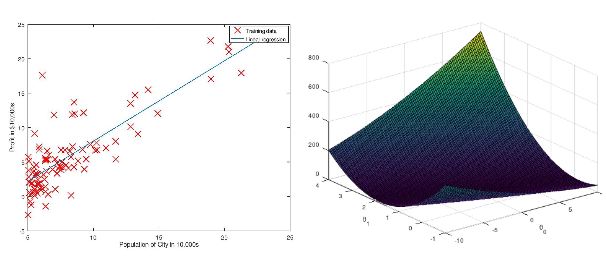
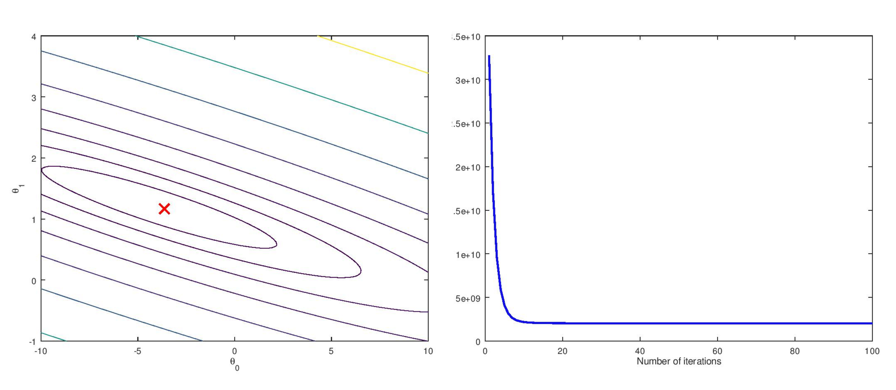
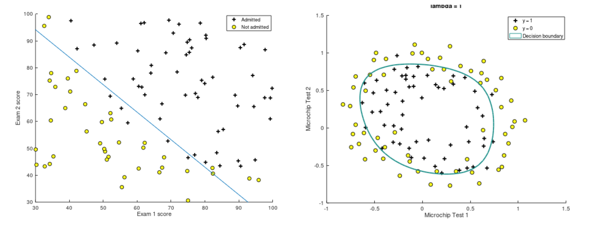
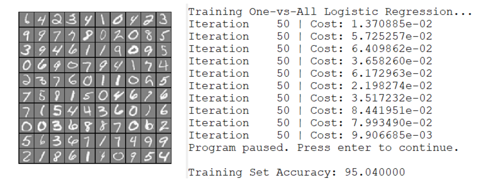
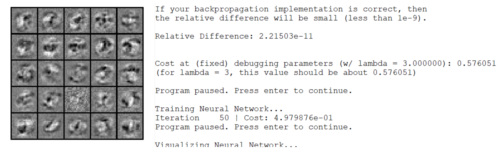

# This repo contains the solutions to Andrew NG's course on Machine Learning. 
(Will be updated in accordance with progress in course)

## The problem statements are enclosed in .pdf format inside each directory.

The programs can be run easily inside Octave or MATLAB.

## Brief description of the problems and the results:

### EX-1

Implementing linear regression (both Univariate and Multivariate) using Gradient Descent as optimiser as well as verification using Normal Equation.

### EX-2

Implementing and visualising logistic regression using Gradient Descent and fminfunc as optimiser.

### EX-3

Implementing One vs All logistic regression to classify handwritten number (MNIST dataset). Training set accuracy: 95.04%

### EX-4

Implementing Neural Network to classify handwritten numbers (MNIST dataset) using feedforward and backpropagation algorithm.

