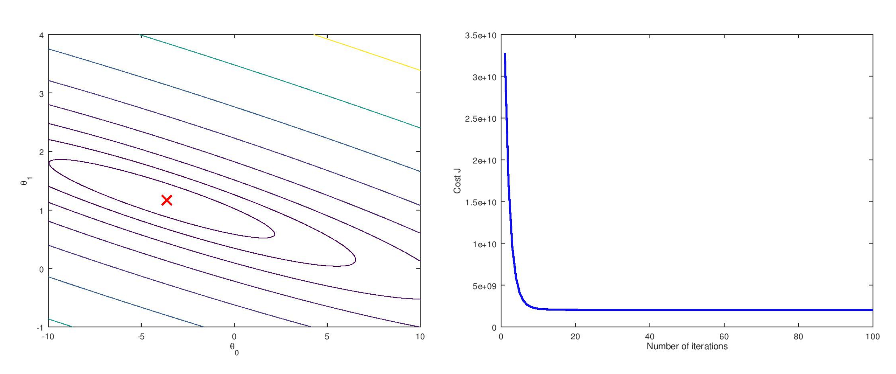

# This repo contains the solutions to Andrew NG's course on Machine Learning (Stanford - Coursera).

~~(Will be updated in accordance with progress in course)~~

## The problem statements are enclosed in .pdf format inside each directory.

The programs can be run easily inside Octave or MATLAB.

## Brief description of the problems and the results:

### EX-1

Implementing linear regression (both Univariate and Multivariate) using Gradient Descent as optimiser as well as verification using Normal Equation.

### EX-2

Implementing and visualising logistic regression using Gradient Descent and fminfunc as optimiser.

### EX-3

Implementing One vs All logistic regression to classify handwritten number (MNIST dataset). Training set accuracy: 95.04%

### EX-4

Implementing Neural Network to classify handwritten numbers (MNIST dataset) using feedforward and backpropagation algorithm.

### EX-5

Learning and tuning parameters such as lambda for regularisation via cross Validation by plotting Validation Curve.

### EX-6

Implementing a linear SVM for random dataset using RBF(Radial Basis Function) and also a spam email classifier.

### EX-7

Implementing K-Means algorithm to cluster some unorganised data. Also implementing Principal Component Analysis(PCA) to performm dimensionality reduction.

### EX-8

Implementing the anomaly detection algorithm and applying it to detect failing servers on a network. Also implementing collaborative filtering to build a recommender system for movies.

